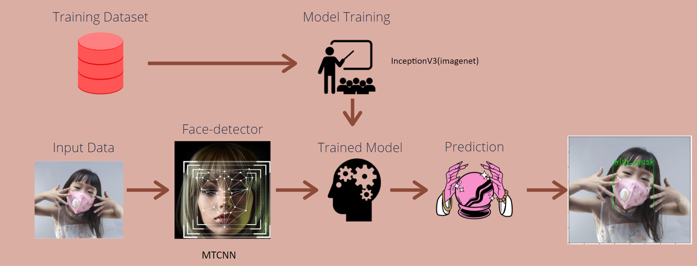

# FaceMe
Identify if a person is wearing a face mask or whether the person is wearing it properly using Computer vision and deep learning.  

  
For the live Demo!
[Click Here!](https://bnati5.github.io/FaceMe/)

&nbsp;&nbsp;&nbsp;&nbsp;&nbsp;&nbsp;&nbsp;&nbsp;&nbsp;&nbsp;&nbsp;&nbsp;&nbsp;&nbsp;&nbsp;&nbsp;&nbsp;&nbsp;&nbsp;&nbsp;&nbsp;&nbsp;&nbsp;&nbsp;&nbsp;&nbsp;&nbsp;&nbsp;&nbsp;&nbsp;&nbsp;&nbsp;&nbsp;&nbsp;&nbsp;

### The **[Dataset](https://www.kaggle.com/netflix-inc/netflix-prize-data)**
Masks play a crucial role in protecting the health of individuals against respiratory diseases, as is one of the few precautions available for COVID-19 in the absence of immunization. With this dataset, it is possible to create a model to detect people wearing masks, not wearing them, or wearing masks improperly.  
This dataset contains 853 images belonging to the 3 classes, as well as their bounding boxes in the PASCAL VOC format.  
The classes are:

* With mask
* Without mask
* Mask worn incorrectly

## Directory structure

            Face Mask Detection
            ├───data/
            │    ├───annotations/
            │    └───images/
            ├───notebooks/
            │    ├───Data-exploration-and-preprocessing.ipynb
            │    ├───FaceMe-MTCNN-face-detection.ipynb
            │    ├───FaceMe-ultra-light-face-detection.ipynb
            │    └───Traning-model.ipynb
            ├───modeljs/
            │    ├───model.json
            ...

## Workflow  

* Base model: InceptionV3 with imagenet weights.  
* Face detector: MTCNN  
* AVG FPS: 2.4 
* Model accuracy: 97%  

